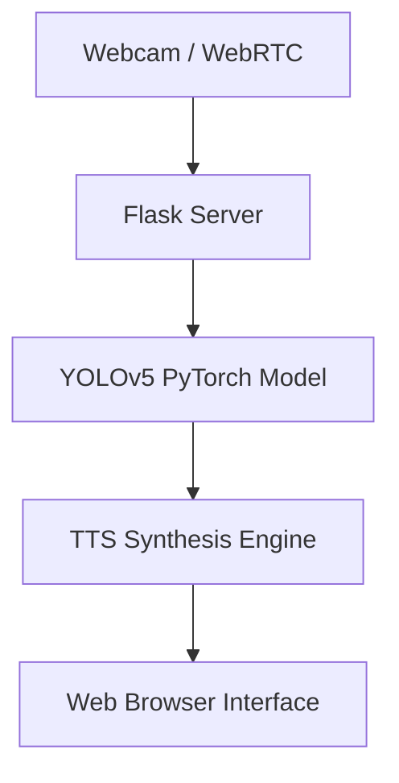

# System Architecture Document — SignLens

**Project Name:** SignLens  
**Author:** Nachiket Gadilohar  

---

## 1. Architecture Diagram

```mermaid
graph TB
    Camera["Webcam / WebRTC"] --> Flask["Flask Server"]
    Flask --> YOLO["YOLOv5 PyTorch Model"]
    YOLO --> Speech["TTS Synthesis Engine"]
    Speech --> UI["Web Browser Interface"]
```
